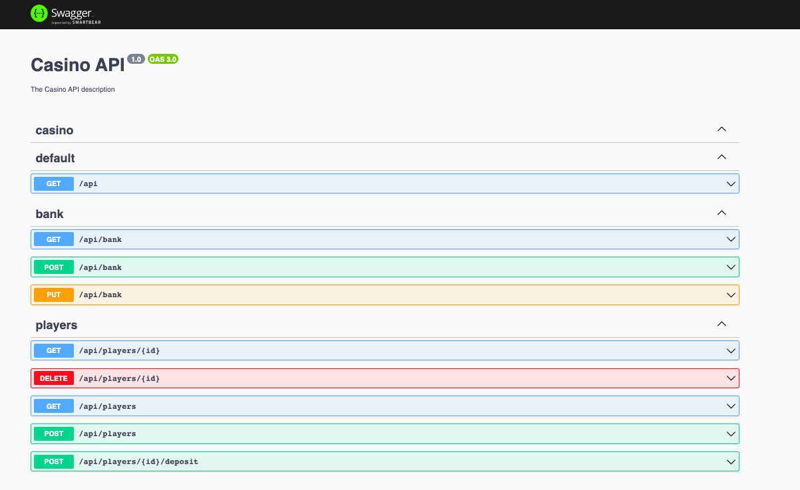

### Spin-Win

Read more about the project [here](./spin-win/ARCHITECTURE.md).

Use scripts defined in [package.json](./spin-win/package.json) to run the apps.

### Preparations

```shell
cd spin-win
pnpm install
```

## Why PNPM?

In this project, we've chosen to use `pnpm` over `npm` for several reasons. `pnpm` is an alternative package manager for Node.js that is designed to provide faster, more efficient package installation. Unlike `npm`, `pnpm` creates a non-duplicated storage of all package files, which results in less disk space usage and faster installation times. Moreover, `pnpm` maintains strict linkage of packages which can avoid certain classes of bugs that are present in `npm` or `yarn`. This enhanced performance and stricter package control make `pnpm` an optimal choice for our project.

### Run NestJS API

```shell
pnpm start:slot-machine-api
```

## Run Angular Client

```shell
pnpm start::slot-machine
```

### Debug in VSCode

In your local `launch.json` create a new entry like this:

```json
{
  "cwd": "${workspaceFolder}/spin-win/apps/slot-machine-api",
  "type": "node",
  "request": "launch",
  "name": "API",
  "skipFiles": [
    "<node_internals>/**"
  ],
  "runtimeExecutable": "pnpm",
  "runtimeArgs": [
    "watch:debug"
  ],
  "outFiles": [
    "${workspaceFolder}/spin-win/dist/apps/slot-machine-api/**/*.js"
  ],
  "outputCapture": "std",
  "console": "integratedTerminal"
}
```

### Swagger UI

http://localhost:3000/api-docs

